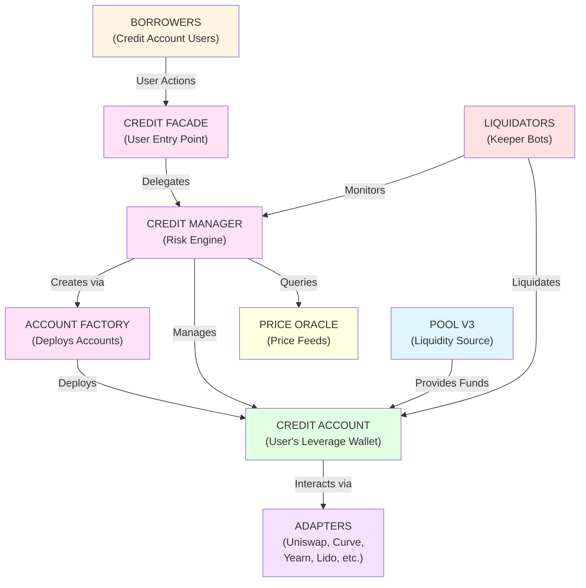
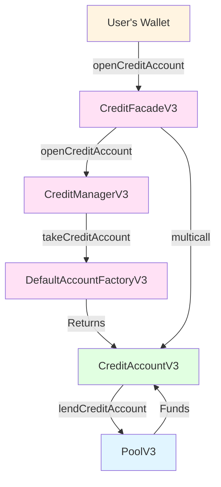
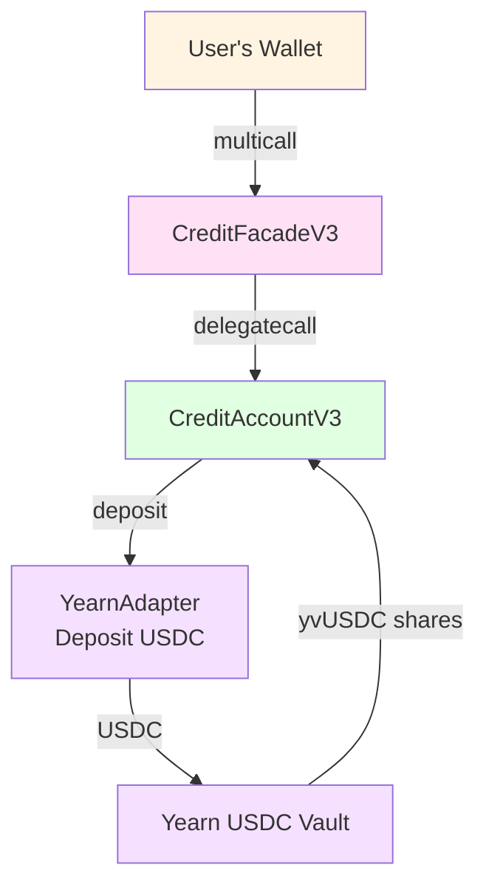
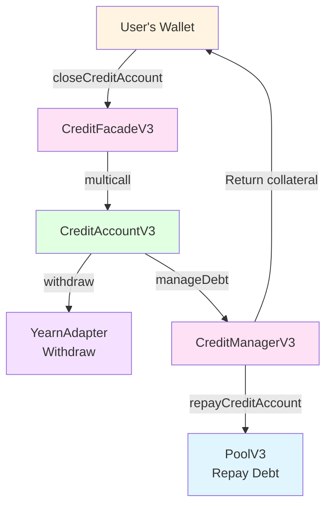
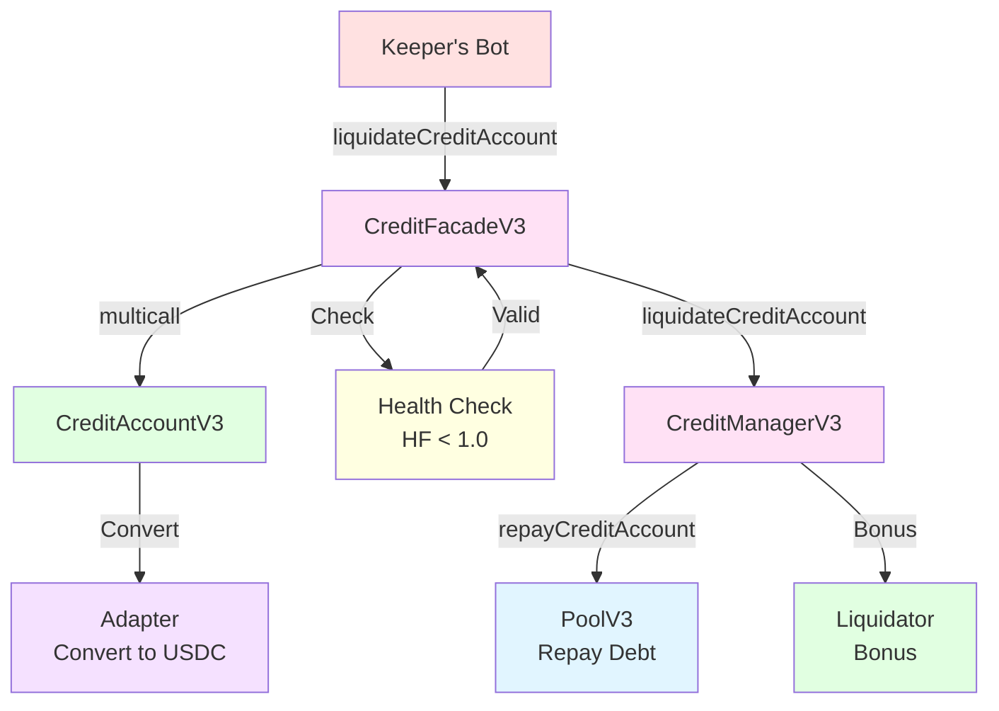
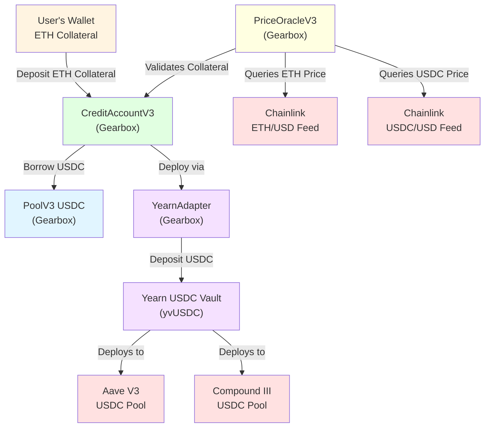
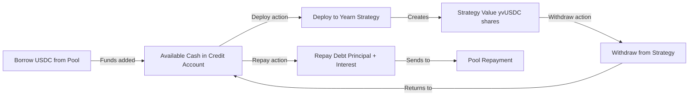

# Gearbox Protocol Analysis
## DeFi Protocol Assignment - Borrow Side Focus

---

## 1. Protocol Selection

**Selected Protocol:** Gearbox Protocol (Borrow Side)  
**Website:** https://app.gearbox.finance/lending

---

## 2. General Functioning of Gearbox Protocol

### 2.1 What the Protocol Does

Gearbox Protocol is a **composable, generalized leverage protocol** that operates as a decentralized credit margin system. It enables users to obtain leverage (borrowed funds) and use those funds across various DeFi protocols in a permissionless, composable manner.

**Core Problem Solved:**
- Traditional DeFi lending (Aave, Compound) allows borrowing but restricts how borrowed funds can be used
- Gearbox solves the "capital efficiency" problem by allowing borrowed funds to be deployed productively across the entire DeFi ecosystem
- It creates a "leverage layer" that other protocols can build upon

Unlike traditional lending protocols where borrowed funds can be withdrawn, Gearbox implements **Credit Accounts** - isolated smart contract wallets that custody both collateral and borrowed funds, restricting usage to approved DeFi operations. This enables leverage for yield farming without the risk of borrowed capital flight.

### 2.2 High-Level Mechanism



**Key Components:**

1. **Pool V3**: Liquidity pool that provides funds for borrowing. Borrowers draw funds from here. Each pool is isolated per asset (USDC, WETH, DAI, etc.).

2. **Credit Manager**: Risk engine that manages credit accounts, enforces limits, handles liquidations. Sets risk parameters (LTV ratios, liquidation thresholds, allowed adapters) but does not run strategies.

3. **Credit Account**: Isolated smart contract holding user's collateral + borrowed funds. Users run their own strategies through this account.

4. **Adapters**: Permissioned integrations with external DeFi protocols. Credit Accounts interact with external protocols only through whitelisted adapters.

5. **Price Oracle**: Modular oracle system aggregating price feeds from Chainlink, Curve pools (virtual prices), and Uniswap TWAP. Different assets can use different oracle sources.

**Workflow (Borrower Perspective):**
1. Borrower opens Credit Account, deposits WETH as collateral
2. Borrower borrows USDC from Pool into their Credit Account
3. Credit Account (with collateral + borrowed USDC) interacts with adapters:
   - Swap USDC → ETH on Uniswap
   - Deposit ETH → stETH on Lido
   - Provide liquidity → on Curve
4. Position earns yield/fees from external protocols
5. Borrower repays debt + interest, closes account, keeps profit

*Note: Pool liquidity is provided by lenders (not shown in this borrower-focused workflow)*

### 2.3 Positioning in the DeFi Ecosystem

**Who Uses Gearbox (Borrowers):**
- **Leverage Farmers**: Users seeking amplified yields through leverage
- **Traders**: Margin traders wanting long/short exposure
- **Protocols**: Other protocols building on Gearbox (e.g., Yearn strategies)


**How Gearbox Compares:**

**vs. Aave V3**: Aave requires borrowers to withdraw borrowed assets to external wallets, losing composability. Gearbox keeps funds within Credit Accounts, enabling direct strategy execution via adapters.

**vs. Compound V3**: Similar to Aave, Compound borrowers must withdraw funds to deploy them elsewhere. Gearbox eliminates this friction by enabling in-protocol strategy execution.

**vs. dYdX V4**: dYdX provides leverage but only for perpetual trading. Gearbox offers general-purpose leverage for any DeFi strategy (yield farming, LP provision, staking, etc.).

**Key Advantage**: Gearbox's Credit Account architecture enables composable leverage—borrowed funds can execute strategies across multiple protocols (Uniswap, Yearn, Lido) without withdrawal, maintaining capital efficiency and reducing operational overhead.

**Ecosystem Integrations:**
- **Liquidity Sources**: Pools for USDC, WETH, WBTC, DAI, USDT, GHO, crvUSD (where borrowers obtain funds)
- **DEXes**: Uniswap V2/V3, Sushiswap, Curve
- **Yield**: Yearn, Convex, Aura, Lido, Rocket Pool
- **RWA**: sDAI, sUSDe, and other yield-bearing assets

---

## 3. Main Contracts for Yield Farmers

### 3.1 Contract Architecture

Gearbox V3 contracts are organized into three functional layers:

**Layer 1: User Interface**
- **CreditFacadeV3**: Entry point for all user actions, handles multicall batching, validates debt limits and permissions

**Layer 2: Core Logic**
- **CreditManagerV3**: Manages credit accounts, risk checks, debt management, liquidations
- **PoolV3**: Lending pool (ERC-4626 compatible), provides borrowed funds to credit accounts
- **CreditAccountV3**: Isolated smart contract wallet (cloned from master), executes adapter calls via delegatecall

**Layer 3: Supporting Infrastructure**
- **DefaultAccountFactoryV3**: Deploys/clones Credit Accounts using minimal proxy pattern
- **PriceOracleV3**: Price feeds for collateral and debt valuation
- **PoolQuotaKeeperV3**: Quota interest rate management
- **LinearInterestRateModelV3**: Base interest rate calculations
- **CreditConfiguratorV3**: Risk parameter configuration (governance only)
- **BotListV3**: Manages authorized liquidation bots

### 3.2 Primary Contracts (Yield Farmer Interactions)

| Contract | Role | Key Functions |
|----------|------|---------------|
| CreditFacadeV3 | User entry point | `openCreditAccount()`, `multicall()`, `closeCreditAccount()`, `liquidateCreditAccount()` |
| CreditManagerV3 | Core risk engine | `openCreditAccount()`, `manageDebt()`, `liquidateCreditAccount()` |
| PoolV3 | Lending pool | `lendCreditAccount()`, `repayCreditAccount()` |
| CreditAccountV3 | Isolated wallet | Executes adapter calls via delegatecall |

### 3.3 Supporting Contracts

| Contract | Role |
|----------|------|
| DefaultAccountFactoryV3 | Deploys Credit Accounts (clone pattern for gas efficiency) |
| PriceOracleV3 | Collateral/debt price feeds with dual-feed validation |
| PoolQuotaKeeperV3 | Quota interest rate management |
| LinearInterestRateModelV3 | Base interest rate calculations (two-kink piecewise linear model) |
| CreditConfiguratorV3 | Risk parameter updates (governance only) |
| BotListV3 | Manages authorized liquidation bots |

**Note on Adapters**: Adapter contracts (Uniswap, Curve, Yearn, Lido, etc.) are external contracts not included in the core-v3 repository. They are whitelisted by governance and enable Credit Accounts to interact with external DeFi protocols.

### 3.4 User Actions and Contract Interactions

#### Action: Open Credit Account & Borrow

**User:** Yield farmer wanting leverage

**Function:** `CreditFacadeV3.openCreditAccount(address onBehalfOf, MultiCall[] calldata calls, uint256 referralCode)`

**Flow:**

1. CreditFacade calls `CreditManagerV3.openCreditAccount(onBehalfOf)` → Gets/clones Credit Account from DefaultAccountFactoryV3
2. If `calls[]` provided: Executes multicall (collateral transfer, borrowing, strategy deployment all happen via multicall)
3. Collateral check ensures account is healthy

**Note:** Collateral transfer and borrowing happen via multicall operations, not directly in `openCreditAccount`. The multicall enables batching multiple operations in a single transaction.



#### Action: Execute Strategy (Multicall)

**User:** Borrower deploying borrowed funds

**Function:** `CreditFacadeV3.multicall(address creditAccount, MultiCall[] calldata calls)`

**Flow:**

1. Each call in `calls[]` targets adapter contracts (e.g., YearnAdapter, UniswapAdapter)
2. Credit Account executes calls via delegatecall
3. Final collateral check ensures account remains healthy

**Note:** Multicall enables batching multiple operations (add collateral, borrow, deploy to Yearn, swap tokens, etc.) in a single transaction, maintaining atomicity and gas efficiency.



#### Action: Close Credit Account & Repay

**User:** Borrower exiting position

**Function:** `CreditFacadeV3.closeCreditAccount(address creditAccount, MultiCall[] calldata calls)`

**Flow:**

1. If `calls[]` provided: Executes multicall to unwind strategies (withdraw from Yearn, swap to debt token, repay debt via `manageDebt` with `DECREASE_DEBT`)
2. CreditFacade calls `CreditManagerV3.closeCreditAccount(creditAccount)` → Ensures debt is zero, returns collateral to user
3. Credit Account returned to factory queue for reuse (after delay period)

**Note:** Debt must be zero before closing (enforced by CreditManager). Users typically use multicall to withdraw from strategies, swap to debt token, and repay debt in a single transaction.



#### Action: Liquidate

**User:** Liquidator (bot or keeper)

**Function:** `CreditFacadeV3.liquidateCreditAccount(address creditAccount, address to, MultiCall[] calldata calls)`

**Trigger:** Credit Account Health Factor < 1.0

**Flow:**

1. CreditFacade checks Health Factor < 1.0 (via `_revertIfNotLiquidatable`)
2. If `calls[]` provided: Executes multicall to convert assets to debt token (via adapters)
3. CreditFacade calls `CreditManagerV3.liquidateCreditAccount()` → Repays debt to pool, liquidator receives bonus
4. Remaining funds (if any) sent to `to` address
5. Account state reset: debt = 0, quotas removed, enabled tokens reset
6. Account remains in system but can be closed later via `closeCreditAccount()` to return to factory

**Post-Liquidation State:**
- Account debt is zeroed, but account is NOT automatically returned to factory
- Account remains in CreditManager's `creditAccountsSet` until explicitly closed
- Anyone can call `closeCreditAccount()` on a liquidated account (since debt = 0) to return it to factory for reuse
- User loses entire position (collateral seized, debt repaid, liquidation penalty applied)

**Note:** Liquidations can be called by anyone, but typically executed by authorized bots. The multicall enables liquidators to convert collateral assets to the debt token before liquidation.




---

## 4. Dependencies and Second-Order Exposure Analysis

This section analyzes dependencies and second-order risks for a specific position: **Borrowing USDC from Gearbox Pool using ETH as collateral and deploying borrowed USDC to Yearn USDC Vault**. This leveraged yield farming strategy demonstrates the dependency chain and risk exposures inherent in Gearbox's composable leverage model, including ETH price volatility and oracle dependencies.

### 4.1 Yearn USDC Vault Position Analysis

### 4.1.1 Position Overview

**Strategy:** Borrow USDC from Gearbox Pool using ETH as collateral and deploy borrowed USDC to Yearn USDC Vault

**User Action Flow:**
1. Deposit ETH as collateral in Credit Account
2. Borrow USDC from Gearbox USDC Pool
3. Deploy borrowed USDC to Yearn USDC Vault via adapter
4. Earn Yearn yield on deployed funds
5. Close position: withdraw from Yearn, repay debt, keep profit

### 4.1.2 External Dependencies

**Oracle Dependencies:**

| Dependency | Role | Type |
|------------|------|------|
| Chainlink ETH/USD Price Feed | Primary ETH collateral price source | Oracle Network |
| Chainlink USDC/USD Price Feed | Primary USDC debt price source | Oracle Network |
| Gearbox PriceOracleV3 | Aggregates price feeds, validates ETH and USDC pricing | Oracle System |

**Protocol Dependencies:**

| Dependency | Role | Type |
|------------|------|------|
| Yearn USDC Vault | Yield source, holds user's deployed USDC | Yield Protocol |
| Yearn Registry | Vault discovery and validation | Integration Layer |
| Yearn Adapter (Gearbox) | Enables Credit Account to interact with Yearn vault | Adapter Contract |

**Underlying Lending Protocols:**

| Dependency | Role | Type |
|------------|------|------|
| Aave V3 USDC Pool | Yearn deploys USDC here for yield | Lending Protocol |
| Compound III USDC Pool | Yearn deploys USDC here for yield | Lending Protocol |

**Gearbox Core Contracts:**

| Dependency | Role | Type |
|------------|------|------|
| PoolV3 (USDC) | Provides borrowed USDC funds | Lending Pool |
| CreditManagerV3 | Manages credit accounts, risk checks | Core Contract |
| CreditFacadeV3 | User entry point, multicall execution | Core Contract |
| DefaultAccountFactoryV3 | Deploys Credit Accounts | Factory Contract |

### 4.1.3 Dependency Chain



### 4.1.4 Second-Order Exposure Analysis

This position creates second-order exposures through multiple dependency layers:

**Exposure to Borrowed Assets and Credit Routing:**
- **Gearbox Pool Insolvency**: If PoolV3 becomes insolvent, borrowed USDC may not be available for withdrawal, trapping positions
- **Interest Rate Spikes**: Gearbox borrow rates can spike during high utilization, making yield < borrow cost (negative carry)
- **Pool Liquidity Crisis**: If all borrowers try to close simultaneously, pool utilization → 100%, preventing position closure

**Exposure to Upstream Protocol Solvency:**
- **Yearn Vault Exploit**: Smart contract hack in Yearn USDC vault could result in total loss of deployed funds
- **Aave/Compound Insolvency**: If Aave V3 or Compound III USDC pools become insolvent, Yearn's underlying assets are at risk, affecting vault share value
- **Yearn Strategy Failure**: Yearn's automated strategies may underperform or fail, reducing yield below borrow costs

**Exposure to Liquidation Cascades:**
- **ETH Price Volatility**: ETH price drops reduce collateral value, triggering liquidations across leveraged positions
- **Oracle Manipulation**: False price feeds (especially ETH/USD) could trigger incorrect health factor calculations, causing premature liquidations
- **Mass Liquidation Events**: Large-scale liquidations can create downward ETH price pressure, triggering further liquidations in a cascade

**Exposure to Oracle Manipulation:**
- **Chainlink ETH/USD Feed Stale/Manipulated**: Incorrect ETH price from Chainlink could cause PriceOracleV3 to calculate wrong collateral values, leading to false liquidations
- **Chainlink USDC/USD Feed Issues**: Incorrect USDC price could affect debt valuation, though USDC is typically stable
- **Flash Loan Attacks**: Attackers could manipulate oracle prices temporarily (especially ETH) to trigger liquidations at favorable prices

| Risk Category | Exposure Level | Key Second-Order Risks |
|---------------|----------------|------------------------|
| **Borrowed Asset/Credit Routing** | High | Pool insolvency, interest rate spikes, liquidity crises |
| **Upstream Protocol Solvency** | High | Yearn vault hack, Aave/Compound insolvency, strategy failure |
| **Liquidation Cascades** | Medium-High | ETH price volatility, oracle manipulation, mass liquidation events |
| **Oracle Manipulation** | Medium | Chainlink ETH/USD feed issues, flash loan attacks, price feed manipulation |
| **ETH Price Risk** | High | ETH volatility directly affects collateral value and health factor |
| **Gearbox Protocol Risk** | Critical | Credit Manager bugs, adapter exploits, pool parameter manipulation |
| **USDC Systemic Risk** | Medium | Stablecoin depeg (less likely but affects debt valuation) |

### 4.1.5 Risk Tree

| Risk Category | Impact | Probability | Key Risks | Outcome |
|--------------|--------|------------|-----------|---------|
| **Collateral Risk** | High | Medium-High | ETH price volatility, ETH price drops | Health factor drops, forced liquidation |
| **Debt Risk** | Medium | High | Borrow amount grows with interest over time | Debt service burden increases, reduces net position value |
| **Yearn Yield Risk** | Medium | Medium | Yearn strategies underperform borrow cost | Net negative carry, position loses value over time |
| **Yearn Protocol Risk** | Critical | Low | Yearn vault smart contract exploit | Total loss of deployed funds, liquidation triggered |
| **Underlying Lending Risk** | High | Low-Medium | Aave/Compound insolvency | Yearn vault value drops, affects share price |
| **Gearbox Adapter Risk** | Critical | Low | YearnAdapter exploit | Funds drained from Credit Account |
| **Gearbox Pool Risk** | Critical | Low | PoolV3 insolvency or parameter manipulation | Cannot borrow/repay, positions trapped |
| **Oracle Risk** | High | Low | Chainlink ETH/USD feed stale/manipulated | Incorrect health factor, false liquidations |
| **Liquidation Cascade Risk** | High | Medium | ETH price drop triggers mass liquidations | Downward ETH price pressure, further liquidations |
| **Market Liquidity Risk** | Medium | Medium | USDC liquidity crisis, pool utilization 100% | Cannot close position, stuck until liquidity returns |

### 4.1.6 Key Scenarios

**Scenario 1: Yearn Vault Exploit**
- Trigger: Yearn USDC vault smart contract hack
- Impact Chain:
  1. Yearn vault drained of USDC
  2. User's Yearn shares worth $0
  3. Collateral = only original deposit
  4. Debt = borrowed + interest
  5. HF drops to near 0
  6. Liquidation triggered
  7. User loses entire position

**Scenario 2: ETH Price Drop Event**
- Trigger: ETH price drops 30% (e.g., from $3,000 to $2,100)
- Impact Chain:
  1. ETH price drops to $2,100
  2. Collateral value drops proportionally (e.g., 10 ETH collateral: $30k → $21k)
  3. Debt remains same (nominal USDC, e.g., $20k)
  4. Health Factor drops: ($21k * 0.95) / $20k = 0.9975 → **Liquidation triggered**
  5. Liquidator seizes ETH collateral at discount
  6. User loses entire position

**Scenario 3: Positive Carry Trade**
- Trigger: Yearn yield > Gearbox borrow rate
- Impact Chain:
  1. Yearn APY = 8%
  2. Gearbox borrow APY = 5%
  3. Net yield = 3%
  4. Position appreciates over time
  5. User profits on leverage

---

## 5. Python Simulator Implementation

### 5.1 Framework and Architecture

**Framework:** Streamlit web application  
**File:** `gearbox_simulator.py`  
**Run Command:** `streamlit run gearbox_simulator.py`

**Core Components:**
- `GearboxSimulator`: Main simulator class managing pool, users, and credit accounts
- `CreditAccount`: Represents individual leveraged positions with collateral, debt, and strategy
- `YearnVaultStrategy`: Simulates Yearn USDC vault with yield accrual (8% APY)
- `Pool`: Implements Gearbox's two-kink piecewise linear interest rate model
- `Oracle`: Price oracle for collateral (ETH) and borrowed assets (USDC)

### 5.2 Implemented Features

**User Actions:**
- ✅ Open new credit account (borrow USDC with ETH collateral)
- ✅ Add collateral to existing account
- ✅ Add additional borrow to existing account
- ✅ Deploy available cash to Yearn USDC strategy
- ✅ Withdraw from strategy back to available cash
- ✅ Repay debt (principal + interest)
- ✅ Liquidate accounts (when Health Factor < 1.0)

**State Management:**
- User wallet balances (ETH, USDC)
- Credit account balances (collateral, borrowed, strategy, available cash)
- Pool state (liquidity, utilization, borrow rates)
- Time-based accruals (interest on debt, yield in strategy)

**Monitoring & Risk:**
- Health Factor calculation and real-time display
- Account status classification (Healthy ≥1.2, At Risk 1.0-1.2, Liquidatable <1.0)
- Price stress testing (simulate ETH/USDC price drops)
- Interest accrual over time (daily compounding)
- Yield accrual in deployed strategies

### 5.3 Key Mechanics

**Health Factor Calculation:**
```
HF = (Total Collateral × Liquidation Threshold) / Total Debt
Where:
- Total Collateral = Collateral Value + Strategy Value + Available Cash
- Total Debt = Borrowed Principal + Accrued Interest
- Liquidation Threshold = 0.95
```

**Interest Rate Model:**
- Implements Gearbox's Two-Kink Piecewise Linear Model
- Three zones: Growth (0-60% utilization), Optimal (60-85%), Liquidity Crunch (85-100%)
- Effective borrow rate includes 5% spread fee

**Borrow Rate Formula:**
```
If utilization ≤ 60% (Growth Zone):
  Borrow Rate = Base Rate + (Utilization / 0.60) × Slope1

If 60% < utilization ≤ 85% (Optimal Zone):
  Borrow Rate = Base Rate + Slope1 + ((Utilization - 0.60) / (0.85 - 0.60)) × Slope2

If utilization > 85% (Liquidity Crunch Zone):
  Borrow Rate = Base Rate + Slope1 + Slope2 + ((Utilization - 0.85) / (1 - 0.85)) × Slope3

Effective Borrow Rate = Borrow Rate × (1 + Spread Fee)
```

**Parameters (simulator defaults):**
- Base Rate: 2% APY
- Utilization Kink 1: 60%
- Utilization Kink 2: 85%
- Slope 1: 8% APY
- Slope 2: 10% APY
- Slope 3: 30% APY
- Spread Fee: 5%

**Yield Accrual:**
- Yearn strategy yields 8% APY
- Yield accrues daily and increases deposited amount
- Rewards tracked separately and reset on withdrawal

### 5.4 Available Cash Flow

**Flow Diagram:**


**Key Points:**
- **Borrowed funds** start as `available_cash` in the Credit Account
- **Deploy** moves `available_cash` → Yearn strategy (becomes `strategy_value`)
- **Withdraw** moves `strategy_value` → back to `available_cash`
- **Repay** uses `available_cash` to pay down debt (principal + accrued interest)
- `available_cash` counts as collateral for Health Factor calculations

### 5.5 User Interface

**Three Main Tabs:**
1. **Accounts Tab**: View all accounts, open new accounts, add collateral/borrow
2. **Strategies Tab**: Deploy to Yearn, withdraw, repay debt
3. **Liquidations Tab**: Monitor at-risk accounts, simulate price drops, execute liquidations

**Sidebar Features:**
- Pool metrics (liquidity, utilization, borrow APY)
- Time controls (advance time to accrue interest/yield)
- Wallet balance display

**Interactive Elements:**
- Collapsible guidance panels for each tab
- Real-time health factor monitoring
- Button states (disabled when actions unavailable)
- Toast notifications for successful actions

---

## 6. Assumptions and Limitations

### Assumptions Made

1. **Interest Rate Model**: Implements Gearbox's Two-Kink Piecewise Linear Model with three zones (Growth, Optimal, Liquidity Crunch). Uses typical parameter values; actual production values are governance-defined and may vary per pool. Reference: https://docs.gearbox.finance/about-gearbox/economics-and-risk/interest-rate-model
2. **Health Factor**: Simplified calculation (real protocol has more complex risk models including quota factors)
3. **Liquidation**: Assumed instant and successful (no bad debt, no partial liquidations)
4. **Oracle**: Assumed always accurate and up-to-date (no manipulation scenarios in simulator)
5. **Gas Costs**: Not modeled in simulator
6. **Slippage**: Not modeled for DEX operations
7. **No MEV**: Ignores frontrunning and sandwich attacks
8. **Yield APY**: Fixed 8% APY for Yearn strategy (real vaults have variable rates)
9.  **Rewards**: Simplified reward tracking (no separate reward token mechanics)

**Included:**
- Core borrow and account management flows
- Health factor calculation and monitoring
- Interest accrual on borrowed funds
- Yield accrual in deployed strategies
- Strategy deployment and withdrawal
- Debt repayment
- Liquidation mechanics
- Price stress testing
- Real-time UI with Streamlit


---

## References

1. Gearbox Documentation: https://docs.gearbox.finance
2. Deployed Contracts: https://dev.gearbox.finance
3. GitHub Repository: https://github.com/Gearbox-protocol/core-v3
4. Dune Analytics Dashboards
5. Chaos Labs LT Methodology Report (2024)

---

## 7. AI Usage

**Tools Used:**
- **OpenCode with MiniMax M2.1**: Coding and analysis tasks
- **Cursor**: Planning and coding assistance
- **ChatGPT**: Research and explanation of protocol mechanics

**Workflow and Challenges:**

AI tools, particularly for code generation, tend to produce verbose and sometimes overly complex implementations. Throughout development, multiple iterations were required to simplify the codebase and remove unnecessary complexity. Additionally, several formulas and calculations generated by AI were incorrect or didn't match the official protocol documentation. This necessitated manual verification of function logic, cross-referencing with Gearbox's official documentation, and providing corrected formulas to ensure accuracy. Critical areas requiring verification included the interest rate model calculations, health factor formulas, and pool accounting logic.

The final code underwent extensive review and testing cycles. When bugs were discovered, detailed descriptions of the issue, expected behavior, and actual behavior were provided to the LLM to help identify root causes and suggest solutions. This iterative process of testing, identifying problems, describing them clearly, and refining the implementation was crucial for achieving a working and accurate simulator.

### Example Prompts

**Protocol Analysis:**
- Review progress and identify next steps
- Specify use of mermaid diagrams for architecture visualization
- Correct borrow rate formula based on official documentation
- Simplify documentation structure and formatting

### Simulator Development Prompts

**Key Prompts Used:**
- Fix bug where available balance doesn't update after borrowing
- Update health factor calculation to include available cash as collateral
- Add conditional button states based on account balances and strategy status
- Perform code review to identify bugs, unused code, and improvements
- Reset strategy rewards when withdrawing funds

### Corrections Made

**Protocol Understanding:**
- Interest rate model (linear → kinked two-kink model)
- Health factor formula (missing liquidation threshold)
- Contract roles (CreditManager vs CreditFacade)
- Adapter mechanism (delegatecall pattern)

**Simulator Bugs Fixed:**
- Available cash not updating when adding borrow
- Health factor missing available_cash in calculation
- Missing available_cash in close_credit_account and liquidation calculations
- Pool total_borrowed incorrectly reduced by interest (should only reduce principal)

### Human Value

- Technical verification of protocol mechanics
- Architecture understanding and contract flow analysis
- Real-world parameter selection (interest rates, liquidation thresholds)
- Risk assessment and dependency analysis
- Testing and debugging simulator logic
- Code quality improvements (removed unused code, fixed bugs)
- UI/UX design decisions (button states, guidance panels)
- Simplification choices
