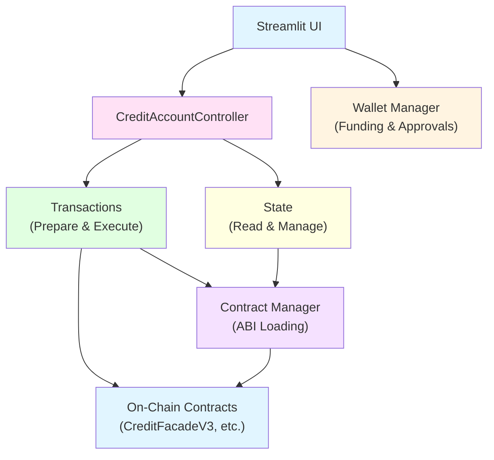

# Architecture Overview

This document provides a high-level overview of the `gearbox_fork` module architecture.

## Design Principles

1. **Separation of Concerns**: Data preparation is separate from execution
2. **Pure Functions**: Action builders are pure (no side effects)
3. **State Management**: State can be tracked and persisted in sessions
4. **Composability**: Actions can be batched and combined
5. **UI-Ready**: Designed for interactive UIs (e.g., Streamlit)

## High-Level Architecture



## Core Components

### 1. Transactions (`transactions.py`)
Combines transaction preparation and execution. Pure functions like `prepare_add_collateral()`, `prepare_increase_debt()` prepare call data, while `execute_multicall()`, `execute_open_account()` handle execution.

### 2. State (`state.py`)
Combines state reading and management. `StateReader` reads on-chain state, `StateManager` caches and tracks state, and `StateStore` provides session persistence.

### 3. Contract Manager (`contracts.py`)
Manages contract ABIs and provides contract instances for interaction.

### 4. Credit Account Controller (`credit_account_controller.py`)
Main orchestrator that combines transactions and state management. Provides a simple API for UI integration.

### 5. Wallet Manager (`wallet_manager.py`)
Handles wallet funding (from whales) and token approvals.

## Typical Flow

1. **User Action** → Streamlit UI receives user input
2. **Prepare** → Controller uses action builders to prepare call data
3. **Execute** → Executors send transaction to on-chain contracts
4. **Update State** → State manager reads and caches updated account state
5. **Display** → UI shows updated state to user

## Key Features

- **Action Preparation**: Prepare call data without executing
- **Multicall Batching**: Batch multiple actions into a single transaction
- **State Caching**: Automatic state updates after transactions
- **Session Persistence**: State can be stored in UI sessions
- **Error Handling**: Revert reason extraction from failed transactions

## Usage Example

```python
from gearbox_fork.credit_account_controller import CreditAccountController

controller = CreditAccountController(w3, cm, fork_client)

# Prepare and execute actions
calls = [
    controller.prepare_action("add_collateral", token=USDC, amount=10_000 * 10**6),
    controller.prepare_action("increase_debt", amount=5_000 * 10**6),
]

result = controller.execute_multicall(credit_account, calls, account_index=0)
state = controller.get_state(credit_account, refresh=True)
```
